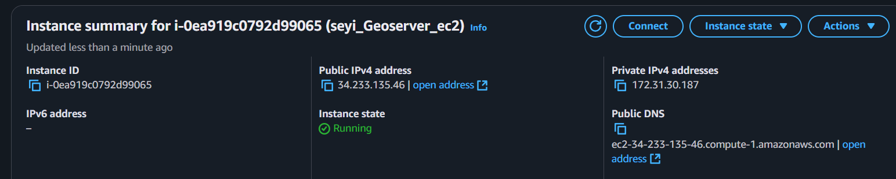
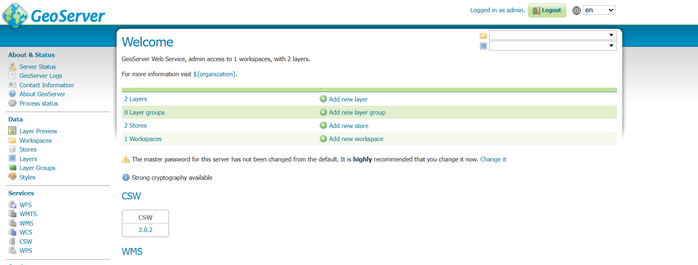
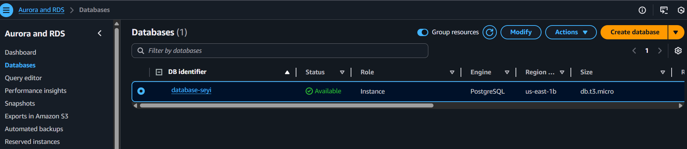
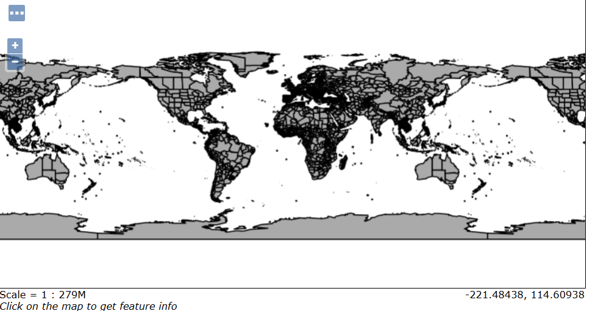
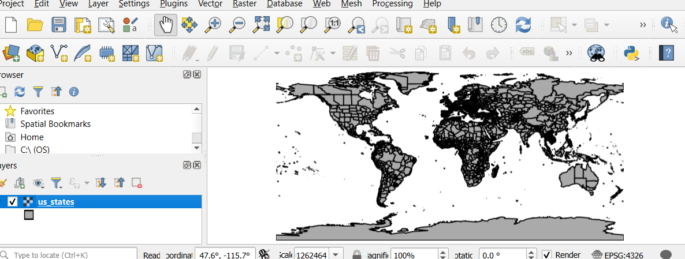
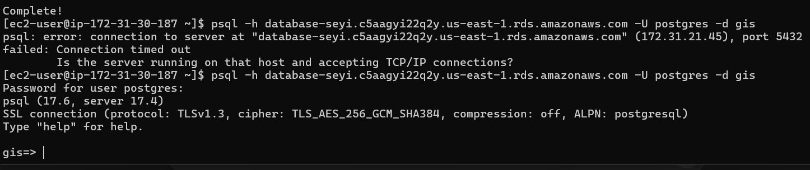

# 🌍 Cloud GIS Deployment with PostGIS + GeoServer + Docker on AWS

This repo demonstrates how to deploy a cloud GIS stack using AWS EC2 + Docker (GeoServer) + RDS (PostGIS).
It provides a reproducible workflow with setup scripts, configuration notes, and screenshots.

## 📖 Project Overview

GeoServer (Docker container) → serves spatial data (WMS/WFS).

PostGIS (AWS RDS) → relational spatial database.

AWS EC2 → cloud host for Docker + GeoServer.

Client (QGIS / Browser) → visualize and validate published layers.

## 🏗️ Architecture

Flow:
RDS (PostGIS) ⟶ EC2 (Docker + GeoServer) ⟶ Client (QGIS/Browser)

## ⚙️ Prerequisites

AWS account with EC2 and RDS access.

SSH key pair for EC2.

Basic knowledge of Docker and AWS Security Groups.

## 🚀 Setup Workflow
### 1. Launch EC2 Instance

Instance type: t2.micro (or higher).

OS: Amazon Linux 23.

Open ports in Security Group:

22 (SSH)

8080 (GeoServer UI)

5432 (Postgres, RDS only — limit to EC2 SG)



### 2. Install Docker & Create Swap
```bash
# Update and install
sudo apt update && sudo apt upgrade -y
sudo apt install docker.io -y

# Add swap (needed for t2.micro)

sudo fallocate -l 1G /swapfile
sudo chmod 600 /swapfile
sudo mkswap /swapfile
sudo swapon /swapfile
echo '/swapfile none swap sw 0 0' | sudo tee -a /etc/fstab
```

### 3. Run GeoServer Container
```  
sudo docker run -d --name geoserver \
  -p 8080:8080 \
  -v /opt/geoserver_data:/var/local/geoserver \
  -e GEOSERVER_ADMIN_USER=admin \
  -e GEOSERVER_ADMIN_PASSWORD=geoserver \
  -e JAVA_OPTS="-Xms256m -Xmx512m" \
  kartoza/geoserver
```

Access UI at: http://<EC2-Public-IP>:8080/geoserver

Default credentials: admin / geoserver (or your custom ones)



### 4. Setup PostGIS on AWS RDS

Launch PostgreSQL RDS instance with PostGIS extension enabled.

Ensure RDS Security Group allows inbound 5432 from EC2’s SG.

Connect from EC2 or local client:
```
psql -h <RDS-ENDPOINT> -U postgres -d gis
```

Enable PostGIS:
```
CREATE EXTENSION postgis;
```



### 5. Connect GeoServer to PostGIS

Login to GeoServer → Data Stores → Add new Store → PostGIS.

Enter RDS connection details.

Publish a layer.



## 🧪 Testing

Load WMS/WFS service in QGIS.

Verify geometry loads from RDS → GeoServer → Client.



## 📂 Repo Structure
geoserver-aws-portfolio/
│
├── README.md                     # Project overview, setup instructions, screenshots placeholders
├── docker/                       # Docker-related scripts
│   └── DockerRunCommands.sh      # Script to run GeoServer container
├── scripts/                      # EC2 setup or helper scripts
│   └── setup-ec2.sh              # Script to install Docker, create swap, etc.
├── notes/                        # Documentation & guides
│   └── rds-setup.md              # RDS/PostGIS setup instructions
├── docs/                         # Visuals & screenshots
│   ├── architecture-diagram.png  # Architecture flow diagram
│   └── screenshots/              # Screenshots of EC2, GeoServer UI, published layers
│       ├── ec2-instance.png
│       ├── docker-ps.png
│       ├── geoserver-login.png
└──     └── geoserver-layer.png


## 🔑 Lessons Learned

t2.micro needs swap to prevent GeoServer crashes.

Always lock down RDS access — only EC2 SG should connect.

Custom admin credentials should be set during docker run.

## 📸 More Screenshots
Docker connection active on EC2

Database connection to EC2

(Add all relevant screenshots here with captions)

## 📌 Next Steps

Automate deployment with Terraform or Ansible.

Use Nginx reverse proxy + HTTPS for production.

Add CI/CD workflows for container rebuilds.
